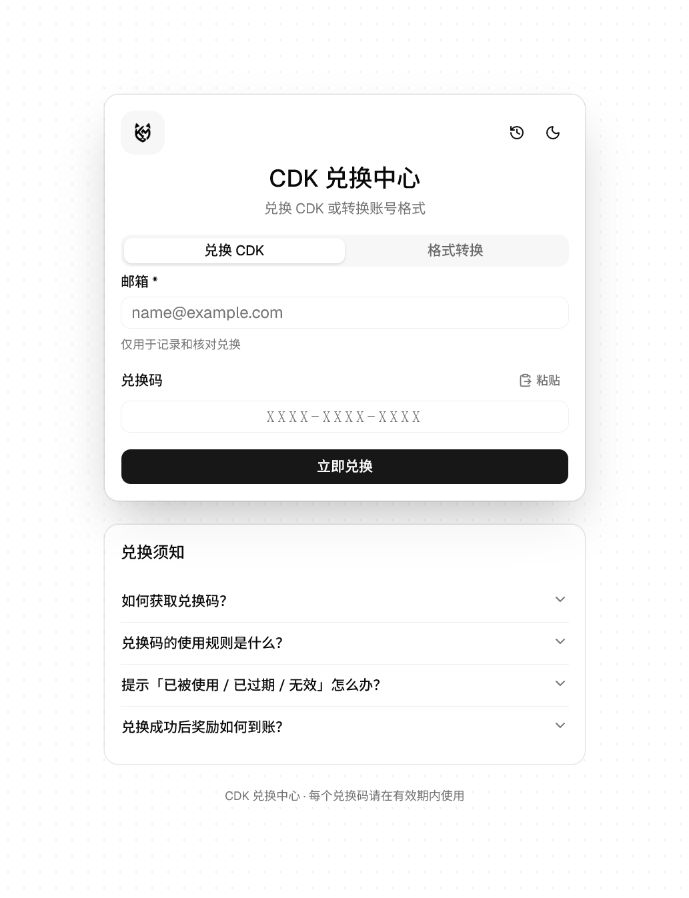
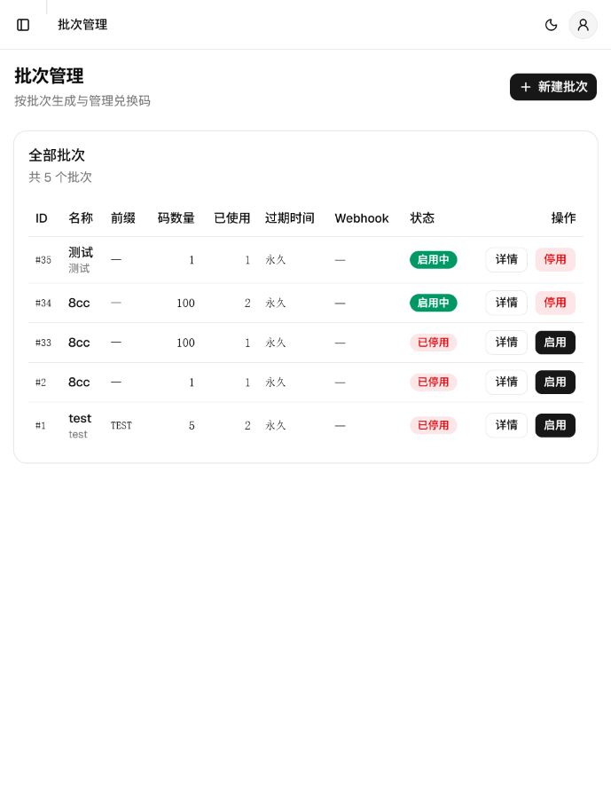
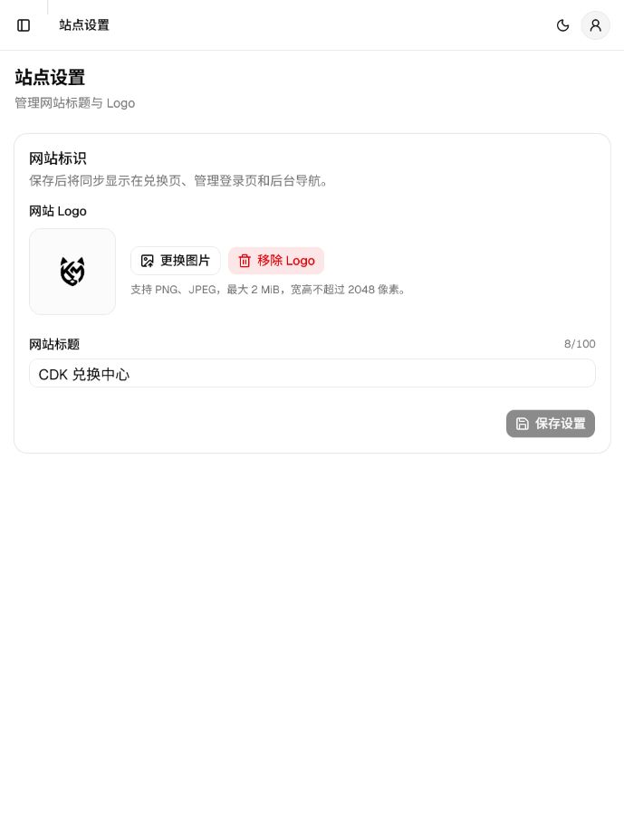

# CDK 兑换系统

基于 Go、PostgreSQL、Redis 和 React 的兑换码系统。Go API 提供兑换、管理和静态页面服务，独立 Worker 处理 Webhook 投递；PostgreSQL 保存业务数据及站点标题/Logo，Redis 保存会话和限流状态。

## 技术栈

- 后端：Go 1.26、Chi、pgx/sqlc
- 数据：PostgreSQL 16、Redis 7
- 前端：React 19、TypeScript、Vite 8
- 部署：Docker Compose、Caddy

## 运行方式

| 场景 | 推荐方式 | 数据库与 Redis | 前端 |
|---|---|---|---|
| 本地开发 | Go 与 Vite 在宿主机运行 | 使用 Compose 仅启动 `postgres`、`redis` 服务 | Vite 热更新，默认代理到 `http://127.0.0.1:8080` |
| 本地完整体验 | Docker Compose | Compose 命名卷 | API 镜像内置构建后的静态文件，由 Caddy 提供 HTTPS 入口 |
| 生产部署 | Docker Compose + Caddy | Compose 命名卷 | Caddy 作为唯一公网入口 |

请始终从仓库根目录执行本文命令。根目录 `.env` 只会被 Docker Compose 自动读取；直接运行 Go 程序时，必须在进程环境中显式设置 `CDK_DATABASE_URL` 和 `CDK_REDIS_URL`。

## Docker Compose 快速启动

需要 Docker Desktop 或 Docker Engine（含 Compose 插件）。首次启动前创建配置文件并修改两个密码：

```powershell
Copy-Item .env.example .env
# 使用编辑器填写 .env 中的必填项
docker compose config --quiet
docker compose up --build -d
docker compose ps
```

Linux/macOS 使用 `cp .env.example .env`，其余 Compose 命令相同。`docker compose config --quiet` 只校验配置，不会启动服务。

Compose 会按顺序完成数据库健康检查、数据库迁移和首个管理员创建，然后启动 API 与 Worker。`admin-init` 仅在管理员表为空时创建账号，重复执行不会覆盖已有密码。

访问地址：

| 页面 | 地址 |
|---|---|
| 用户兑换页 | https://localhost/ |
| 管理后台 | https://localhost/admin |
| API 健康检查 | http://127.0.0.1:8080/healthz |

Caddy 的本地证书通常需要浏览器手动信任。开发环境也可以直接打开 `http://127.0.0.1:8080/`。Windows 用户可在配置 `.env` 后运行 `start.bat`，它等价于前台执行 `docker compose up --build`。

常用命令：

```powershell
docker compose logs -f api worker
docker compose ps -a
docker compose down
docker compose down -v  # 同时删除 PostgreSQL/Redis 数据，仅限确认不再需要数据时
```

PostgreSQL、Redis 和 API 的宿主机端口只绑定到 `127.0.0.1`，不会监听所有网卡。公网入口仅应开放 Caddy 的 80/443 端口。

## 环境变量

Docker Compose 自动读取项目根目录的 `.env`：

| 变量 | 用途 |
|---|---|
| `CDK_POSTGRES_PASSWORD` | PostgreSQL 密码；请使用 URL 安全的长随机字符串 |
| `CDK_ADMIN_USERNAME` | 首次初始化的管理员名 |
| `CDK_ADMIN_PASSWORD` | 首次初始化的管理员密码，至少 8 位且不要与数据库密码相同 |
| `CDK_SITE_ADDRESS` | Caddy 站点地址；本地为 `localhost`，生产环境填写实际域名 |
| `CDK_LOG_LEVEL` | 日志级别，默认 `info` |
| `CDK_SESSION_COOKIE_SECURE` | HTTPS 部署保持 `true`；仅纯 HTTP 本地调试时设为 `false` |
| `CDK_SESSION_COOKIE_SAMESITE` | Cookie SameSite，默认 `strict` |
| `CDK_RATE_LIMIT_REQUESTS` | 限流窗口内允许的请求数，默认 `10` |
| `CDK_RATE_LIMIT_WINDOW` | 限流窗口，默认 `1m` |

直接运行 Go 进程和 Vite 开发服务器时还会用到以下变量；这些值由 Compose 在容器内自动生成、设置或无需使用：

| 变量 | 用途 | 本地默认建议 |
|---|---|---|
| `CDK_DATABASE_URL` | PostgreSQL 连接 URL | `postgres://cdk:<密码>@127.0.0.1:5432/cdk?sslmode=disable` |
| `CDK_REDIS_URL` | Redis 连接 URL | `redis://127.0.0.1:6379` |
| `CDK_HOST` | API 监听地址 | `127.0.0.1` |
| `CDK_PORT` | API 监听端口 | `8080` |
| `ADMIN_PASSWORD` | `admin-create` 一次性读取的管理员密码 | 至少 8 位 |
| `VITE_API_PROXY_TARGET` | Vite 开发服务器的 API 代理目标 | `http://127.0.0.1:8080` |

不要提交 `.env`、`web/.env.local`、数据库文件、私钥、备份或生产导出文件。示例配置只能包含占位值，不应包含可用凭证。

## 生产部署

推荐使用仓库内的 `docker-compose.yml` 与 `Caddyfile`。部署前应满足：域名的 A/AAAA 记录已指向服务器；公网只开放 80/443；Docker 数据目录具有持久化空间；已建立 PostgreSQL 备份与恢复流程。

1. 从 `.env.example` 创建 `.env`，填写两个不同的长随机密码，并将 `CDK_SITE_ADDRESS` 设置为实际域名。
2. 保持 `CDK_SESSION_COOKIE_SECURE=true`。只有完全不使用 HTTPS 的本地调试才可设为 `false`。
3. 校验并启动服务：

```sh
docker compose config --quiet
docker compose build --pull
docker compose up -d
docker compose ps
docker compose logs --tail=100 migrate admin-init api worker caddy
```

4. 通过域名检查 `/healthz`，并通过服务器本机的 `http://127.0.0.1:8080/readyz` 检查 PostgreSQL 与 Redis。

Compose 会在 API 启动前运行全部数据库迁移，并仅在管理员表为空时执行 `admin-init`。首次启动后修改 `CDK_ADMIN_PASSWORD` 不会重置已有管理员密码；修改已初始化数据库的 `CDK_POSTGRES_PASSWORD` 也不会自动修改数据库内部密码。密码轮换需要单独完成管理员密码重置或 PostgreSQL 角色密码变更，并同步更新部署环境。

升级前先备份 PostgreSQL 数据和 `.env`，再更新源码并重新执行 `docker compose build --pull`、`docker compose up -d`。不要在生产环境使用 `docker compose down -v`，它会删除数据库、Redis 和 Caddy 命名卷。

PostgreSQL、Redis 和 API 的宿主机端口只绑定到 `127.0.0.1`。Caddy 是唯一应暴露到公网的服务；`/metrics` 与 `/readyz` 不通过 Caddy 代理。

## 本地开发

需要 Go 1.26、Node.js 22 或 24 与 npm。可以自行安装 PostgreSQL 16/Redis 7，也可以让 Docker 只启动依赖服务。Compose 会先解析完整配置，因此启动依赖前仍需从 `.env.example` 创建 `.env` 并填写 `CDK_POSTGRES_PASSWORD`、`CDK_ADMIN_PASSWORD`：

```powershell
docker compose up -d postgres redis
$env:CDK_DATABASE_URL = "postgres://cdk:<数据库密码>@127.0.0.1:5432/cdk?sslmode=disable"
$env:CDK_REDIS_URL = "redis://127.0.0.1:6379"
go run ./cmd/migrate up
$env:ADMIN_PASSWORD = "<管理员密码>"
go run ./cmd/admin-create admin
```

Bash/zsh 使用同名变量，例如 `export CDK_DATABASE_URL='...'`。Go 程序不会自动加载根目录 `.env`。

管理员创建命令只应在首次初始化时执行；相同用户名已存在时会返回错误。

启动 Go 服务：

```powershell
# 终端 1
$env:CDK_DATABASE_URL = "postgres://cdk:<数据库密码>@127.0.0.1:5432/cdk?sslmode=disable"
$env:CDK_REDIS_URL = "redis://127.0.0.1:6379"
go run ./cmd/api

# 终端 2
$env:CDK_DATABASE_URL = "postgres://cdk:<数据库密码>@127.0.0.1:5432/cdk?sslmode=disable"
$env:CDK_REDIS_URL = "redis://127.0.0.1:6379"
go run ./cmd/worker
```

启动前端热更新：

```powershell
Set-Location web
npm ci
npm run dev
```

打开 http://127.0.0.1:5173。Vite 默认把 `/api` 代理到 `http://127.0.0.1:8080`；需要其他地址时，在 `web/.env.local` 设置：

```dotenv
VITE_API_PROXY_TARGET=http://127.0.0.1:8080
```

生产镜像会在独立 Node 阶段执行 `npm ci` 和 `npm run build`，不读取宿主机的 `web/dist` 或 `node_modules`。

`start.sh` 只用于已经执行 `make build` 和前端构建后的本地 API 启动，不会运行迁移、管理员初始化或 Worker，也不应作为生产启动方式。脚本不会写死数据库或 Redis 地址，运行前必须导出 `CDK_DATABASE_URL` 和 `CDK_REDIS_URL`。Makefile 同样要求调用方提供这些变量；可通过 `ADMIN_USERNAME` 指定初始化用户名。Makefile 使用 POSIX shell 语法，Windows 原生 PowerShell 环境优先使用上面的 `go run` 或 Docker Compose 命令。

## 构建与检查

```powershell
go test ./...
go vet ./...

# 连接隔离的测试库或 schema 后启用 PostgreSQL 集成测试
$env:CDK_TEST_DATABASE_URL = "postgres://cdk:<密码>@127.0.0.1:5432/cdk_test?sslmode=disable"
go test -count=1 -run Integration ./internal/redeem

Set-Location web
npm run lint
npm run build
```

构建 Go 可执行文件也可使用 `make build`。数据库迁移文件位于 `db/migrations`，迁移命令为 `go run ./cmd/migrate up|down|status`。

修改 `db/queries/queries.sql` 或迁移后应重新生成 sqlc 代码：

```sh
go run github.com/sqlc-dev/sqlc/cmd/sqlc generate
```

## 主要接口

- `GET /api/site-settings`、`GET /api/site-logo`：读取站点标题与 Logo
- `POST /api/redeem`：提交邮箱（兼容字段名 `user_id`）和 `code` 完成兑换
- `/api/admin/*`：管理员登录、批次、兑换码、日志、FAQ、凭证和站点设置管理
- `GET /healthz`：进程健康检查
- `GET /readyz`：PostgreSQL 与 Redis 就绪检查

完整请求和响应格式见 [`docs/API_CONTRACT.md`](docs/API_CONTRACT.md)。

用户端会在当前标签页会话中保留最近 20 条成功兑换结果，刷新页面后可从右上角历史入口重新查看，也可删除单条或清空；关闭标签页后自动清除。该记录不会形成可按邮箱公开查询的服务端接口，避免把奖励凭证长期留在共享设备上。

Webhook 使用 `X-CDK-Signature: sha256=<HMAC-SHA256>` 签名。接收端应验证签名，并以 `redemption_id` 做幂等去重。

## 项目截图

截图保存在 [`docs/screenshots/`](docs/screenshots/README.md)：

| 页面 | 文件 |
|---|---|
| 用户兑换页 | `docs/screenshots/redeem-page.png` |
| 批次管理 | `docs/screenshots/admin-batches.png` |
| 站点设置 | `docs/screenshots/site-settings.png` |

### 用户兑换页



### 批次管理



### 站点设置



更新截图前请确认其中没有真实邮箱、兑换码、凭证、Webhook 地址或管理员信息。

## 发布前检查

- `.env`、数据库、备份、导出文件和本机构建产物没有进入发布内容。
- 示例配置中没有真实密码、token、私钥或公网服务地址。
- `go test ./...`、`go vet ./...`、`npm run lint`、`npm run build` 和数据库迁移检查通过。
- 生产域名、HTTPS、Cookie 安全选项、防火墙和数据库备份已经验证。
- 管理员凭证已从首次部署值轮换，并妥善保存在密码管理器中。

## 项目结构

```text
cmd/api/             Go HTTP API 与前端静态文件服务
cmd/worker/          Webhook Worker
cmd/migrate/         数据库迁移命令
cmd/admin-create/    管理员初始化命令
internal/            业务逻辑、存储、认证、限流和可观测性
db/migrations/       PostgreSQL 迁移
db/queries/          sqlc 查询定义
docs/                 API 契约与发布截图说明
web/                 React + Vite 前端
Dockerfile           前端、Go 二进制和运行镜像的多阶段构建
docker-compose.yml   PostgreSQL、Redis、迁移、初始化、API、Worker、Caddy
```
